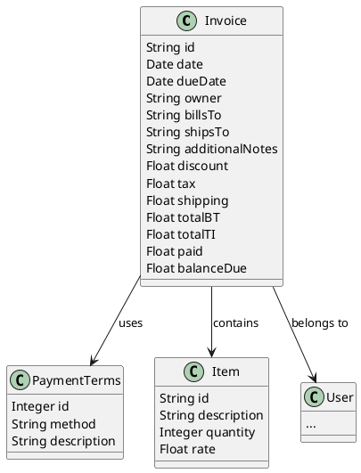

# Questions 
* [[What's a PO Number ?]]
* [[Is having a Purchase Order (PO) number for my invoice model necessary?]]

# Resources
**Class Diagram**

```plantuml
@startuml

class Invoice {
  String id
  Date date
  Date dueDate
  String owner
  String billsTo
  String shipsTo
  String additionalNotes
  Float discount
  Float tax
  Float shipping
  Float totalBT
  Float totalTI
  Float paid
  Float balanceDue
}

class PaymentTerms {
    Integer id
    String method
    String description
}

class Item{
   String id
   String description
   Integer quantity
   Float rate
}

class User{
...
}

Invoice --> PaymentTerms : uses
Invoice --> Item : contains
Invoice --> User : belongs to

@enduml
```